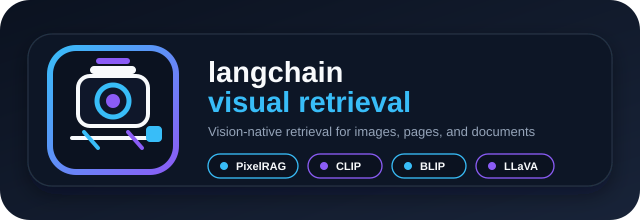
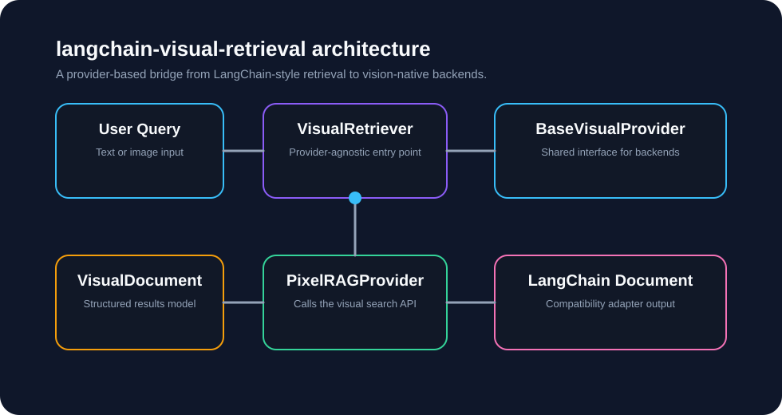

# langchain-visual-retrieval

<p align="center">
  
</p>

langchain-visual-retrieval is a lightweight, provider-based visual retrieval package for LangChain. It adds a clean abstraction for vision-native search so applications can retrieve information from screenshots, diagrams, charts, and other visual content instead of relying only on plain text chunking.

This project is not a fork of LangChain or PixelRAG. Instead, it provides a reusable integration layer that lets LangChain-style applications work with visual retrieval backends through a small and stable interface.

## Why this matters

Traditional retrieval systems work well for text, but they often miss the information that lives in layout, structure, and appearance. A chart, a UI screenshot, a diagram, or a table can contain meaning that plain text parsing loses.

That is why visual retrieval is a major step forward for:

- document search over PDFs, web pages, and screenshots
- question answering over dashboards and reports
- retrieval of UI or product screenshots
- search over diagrams, architecture images, and technical drawings
- multimodal pipelines that combine text and image understanding

In short, this approach can be a real game changer for search engines, natural language processing, and retrieval-augmented generation because it expands retrieval beyond words and into how documents actually look.

## What this package provides

The current package offers a minimal but extensible foundation:

- a provider abstraction for visual retrieval backends
- a first concrete PixelRAG-backed provider
- a retriever that returns structured visual results
- a compatibility adapter that converts visual results into LangChain documents

The design is intentionally simple so future providers can be added without changing the public API.

## Current scope

This release focuses on:

- a provider-based interface for visual retrieval
- a PixelRAG provider implementation for search workflows
- a retriever experience that feels natural in LangChain-style code
- compatibility with LangChain document conventions

It does not attempt to implement a full visual RAG platform, a plugin registry, or a large multimodal stack. The goal is to provide a clean foundation that can grow over time.

## Installation

Install from PyPI:

```bash
pip install langchain-visual-retrieval
```

For local development from this repository:

```bash
pip install -e .
```

## Quickstart

The simplest way to use the package is to create a provider, wrap it in a retriever, and run a query.

```python
from langchain_visual_retrieval import PixelRAGProvider, VisualRetriever

provider = PixelRAGProvider(endpoint="http://localhost:30001")
retriever = VisualRetriever(provider)

results = retriever.search("Find the Kubernetes deployment screenshot")

for result in results:
    print(result.model_dump())
```

Each result is a visual document object with fields such as:

- id
- source
- page
- image_path
- score
- metadata

## Using image-based queries

The provider also supports image-style query payloads. This is useful when your input is a screenshot or another image rather than plain text.

```python
import base64
from pathlib import Path

from langchain_visual_retrieval import PixelRAGProvider, VisualRetriever

provider = PixelRAGProvider(endpoint="http://localhost:30001")
retriever = VisualRetriever(provider)

image_path = Path("example.png")
image_bytes = image_path.read_bytes()
image_payload = {
    "image": base64.b64encode(image_bytes).decode("utf-8"),
    "text": "find the relevant UI screenshot",
}

results = retriever.search(image_payload)
```

## Converting results to LangChain documents

If you need LangChain-compatible document objects, use the adapter layer:

```python
from langchain_visual_retrieval import PixelRAGProvider, VisualRetriever

provider = PixelRAGProvider(endpoint="http://localhost:30001")
retriever = VisualRetriever(provider)

results = retriever.search("Find the deployment screenshot")
documents = retriever.as_documents("Find the deployment screenshot")

print(documents[0].metadata)
```

## Architecture at a glance

<p align="center">
  
</p>

The package follows a simple dependency flow:

- user code uses VisualRetriever
- the retriever calls a provider through the shared interface
- the provider returns structured visual results
- those results can optionally be converted into LangChain documents

This keeps the public API provider-independent while allowing the implementation to stay lightweight and easy to extend.

## Extending with other providers

The package is designed for future providers. To add another backend, implement the same minimal provider interface and keep your logic inside that provider. The retriever and the public API do not need to change.

## License and attribution

This package is distributed under the MIT license.

If you use PixelRAG as a backend, please follow the relevant PixelRAG licensing and attribution terms.

## Summary

langchain-visual-retrieval introduces a practical and extensible path for bringing visual retrieval into LangChain-based systems. It is especially useful when search needs to understand the appearance of documents, not just their text content.

If you are working on multimodal search, screenshot retrieval, visual document understanding, or layout-aware RAG, this package provides a clean starting point.
